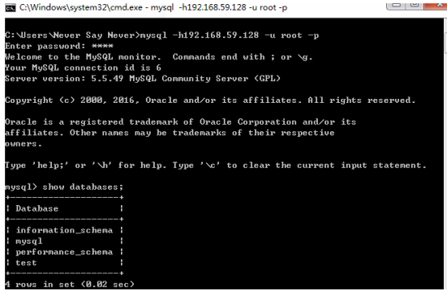
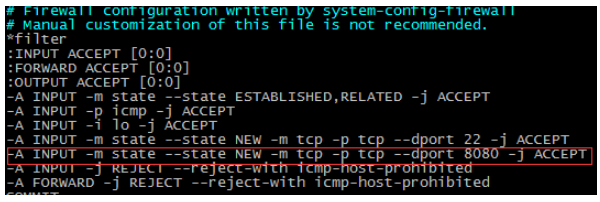
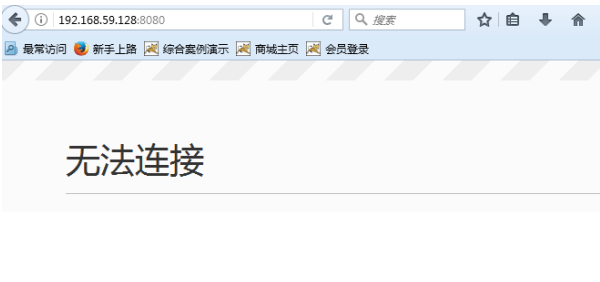

# 第四单元 Linux软件安装

# 【授课重点】

1. 了解Linux应用程序的组成部分
2. 掌握应用程序安装的方法
3. 在Linux中安装JDK
4. 在Linux中安装mysql
5. 在Linux中安装tomcat

# 【考核要求】

1. 掌握应用程序安装方法（tar、rpm、yum）
2. 掌握mysql安装
3. 掌握tomcat安装
4. 掌握本地WEB项目发布到Linux中

# 【教学内容】

## 4.1 课程导入

以后我们开发的项目都需要部署到Linux系统下，都是基于java的，那么就必须安装JDK等相关的软件，配置相关的环境。我们一起来学习下，如何在Linux系统中安装软件。

## 4.2 在Linux中安装JDK

在linux 下安装JDK，可正常使用java和javac等命令

#### **4.2.1 准备工作**

将资料文件夹中的软件目录下的jdk文件上传到Linux系统的用户主目录ee

   

#### **4.2.2 相关知识点：rpm命令**

l 格式：rpm [参数] [软件]

​		-v 　显示指令执行过程。

​		-h或--hash 　套件安装时列出标记。

​		-q 　使用询问模式，当遇到任何问题时，rpm指令会先询问用户。 

​		-a 　查询所有套件。

​		-i<套件档>或--install<套件档> 　安装指定的套件档。

​		-U<套件档>或--upgrade<套件档>   升级指定的套件档。 

​		-e<套件档>或--erase<套件档> 　删除指定的套件。

​		--nodeps 　不验证套件档的相互关联性

​		常用

​			安装：rpm -ivh rpm文件【安装】 

​			升级：rpm -Uvh rpm文件【更新】

​			删除：rpm -e --nodeps 软件名  【卸载软件命令】

​			查看：rpm –qa(配置管道使用)

#### **4.2.3 JDK安装步骤**

l 第一步：查看现有安装的JDK版本

```
rpm -qa | grep -i java 
```

 

openJDK它是Linux系统安装时自带的JDK，我们是不需要的，直接卸载即可！

 

l 第二步：卸载已有的软件

```
rpm -e --nodeps java-1.7.0-openjdk-1.7.0.79-2.5.5.4.el6.x86_64

rpm -e --nodeps java-1.6.0-openjdk-1.6.0.35-1.13.7.1.el6_6.x86_64
```


 

l 第三步：将之前上传好的JDK解压

```
需要先创建目录 mkdir /usr/local/src/java

tar –zxvf jdk1.8.0_65.tar.gz
```

 

l 第四步：将加压好的JDK移动到java目录中

mv jdk1.8.0_65 /usr/local/src/java

 


l 第五步：配置系统环境变量

vim /etc/profile   #进入根目录

在这个配置文件的末尾(先i，可以移动光标，通过上下左右箭头)，添加如下2行代码(建议复制)

```
export JAVA_HOME=/usr/local/src/java/jdk1.8.0_65

export PATH=$JAVA_HOME/bin:$PATH
```

然后使用Esc  :wq保存退出

 

l 第六步：使配置文件生效并测试

先进入JDK的bin目录，然后复制以下2行代码即可：

```
source /etc/profile
```

java –version  #测试是否安装成功


 

如果配置成功，只需要在bin目录下面运行 java –version,在任意目录均可！(上图是bin目录，下图是根目录)

 

## 4.3 在Linux中安装mysql

l 第一步：查看之前版本

```
rpm -qa | grep -i mysql --color
```

 

l 第二步：卸载之前的版本

```
rpm -e --nodeps mysql-libs-5.1.73-5.el6_6.x86_64 
```

 

l 第三步：上传2个rpm的MySQL文件(5.5.49)

 

MySQL安装系统会自动指定目录。

l 第四步：安装server

```
rpm -ivh MySQL-server-5.6.25-1.el6.x86_64.rpm
```

 

l 第五步：安装client

```
rpm -ivh MySQL-client-5.6.25-1.el6.x86_64.rpm
```

 

l 第六步：查询MySQL服务运行状态

```
service mysql status
```

 

l 第七步：启动MySQL服务

```
service mysql start
```

 

l 第八步：使用root账户登录MySQL

使用空密码登录:

```
mysql -uroot -p
```

登录成功后

l 第九步：修改密码

```
SET PASSWORD = PASSWORD('root');
```

 

l 第十步：虚拟机内部登录MySQL

```
mysql -u root –p   密码为之前设置的root
```

 

l 第十一步：远程主机访问，设置防火墙

n 打开防火墙配置

```
vim /etc/sysconfig/iptables
```

n 设置内容

```
-A INPUT -m state --state NEW -m tcp -p tcp --dport 3306 -j ACCEPT
```

 

n 重启服务  

```
service iptables restart
```

 

n 使用mysql语句创建远程登录用户(**登录MySQL**)

```
create user 'root'@'%' identified by 'root';		#创建用户，并设置密码

grant all on *.* to 'root'@'%' with grant option;	#给指定的用户授权

flush privileges;									#刷新权限
```

 

n 远程访问成功

```
mysql -h192.168.59.128 -uroot –proot
```

​	打开DOS窗口，输入上面的命令

 


## 4.4 在Linux中安装tomcat

l 第一步：上传Tomcat

rz 上传

 

l 第二步：解压Tomcat

```
tar -zxvf apache-tomcat-7.0.57.tar.gz
```


 

l 第三步：移动到指定目录java

```
mv apache-tomcat-7.0.57 /usr/local/src/java
```

 

l 第四步：配置防火墙(所有的配置都在etc目录下面,指定windows系统访问的端口号)

```
vim /etc/sysconfig/iptables
```

 

n 运行8080端口远程访问

```
-A INPUT -m state --state NEW -m tcp -p tcp --dport 8080 -j ACCEPT
```

 

n 重启启动防火墙服务

先进入tomcat的安装目录

 

```
service iptables restart     #重启防火墙命令
```

 

l 第五步：启动并访问Tomcat

**进入tomcat所在的bin目录**

```
cd /usr/local/src/java/apache-tomcat-7.0.57/bin
```

 

```
启动tomcat:  ./startup.sh
```

 


浏览器访问：

 

第六步：关闭Tomcat结束测试

 

依旧需要先进入tomcat的bin目录，然后执行 ./shutdown.sh命令

 

# 课堂练习

## 1.采用课堂教案完成java环境的搭建（10分钟)

要求:

​	1.jdk是1.8以上的版本

​	2.采用源码安装并配置环境变量

​	3.使用javac命令编译一个java文件

​	4.查看java版本号

## 2.采用课堂教案完成mysql的安装(20分钟)

要求:

​	1.mysql是5.6版本

​	2.采用rpm安装

​	3.开放3306端口号

​	4.采用windows电脑上的sqlyog或者是Navicat连接linux的mysql

​	5.导入cms项目数据库并且测试通过

​	6.通过ps命令查看mysql进程

## 3.采用课堂教案完成tomcat的安装（15分钟)

要求:

​	1.采用wget下载tomcat

​	2.要求tomcat版本是8.0以上

​	3.开放防火墙端口号8080

​	4.启动tomcat查看启动日志

​	5.测试tomcat首页

​	6.查看tomcat进程

​	7.关闭tomcat

## 4.综合案例（10分钟)

要求:

​	1.把windows上的cms系统部署到linux环境中

​	2.使用linux版mysql作为数据源

​	3.成功访问到首页