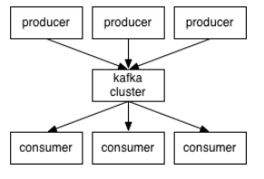
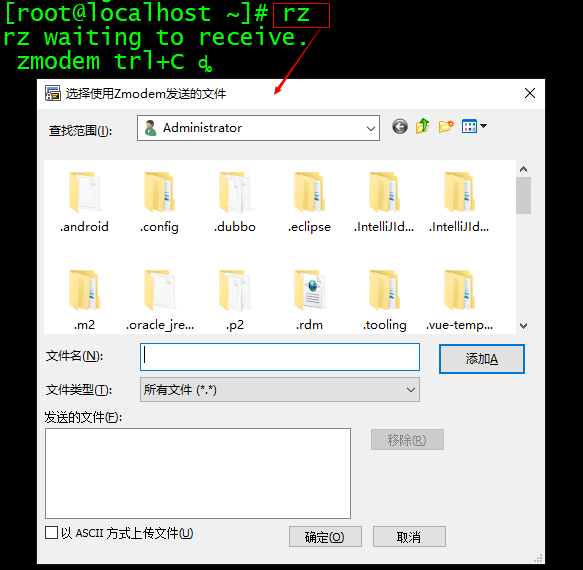
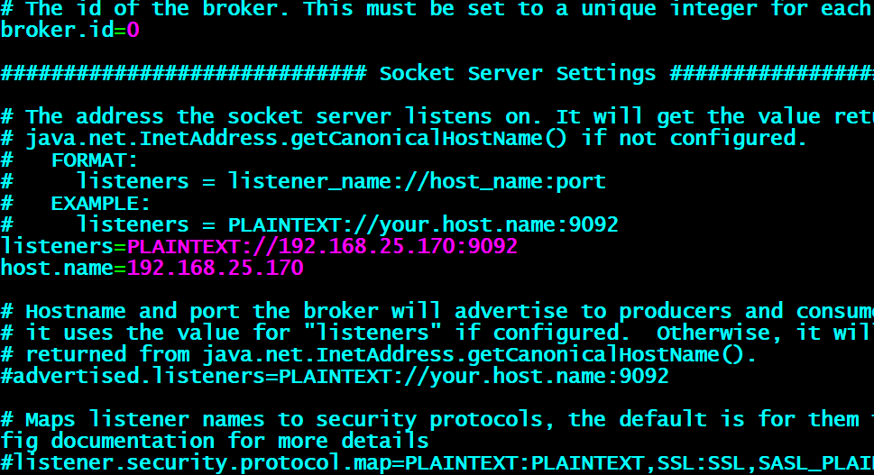
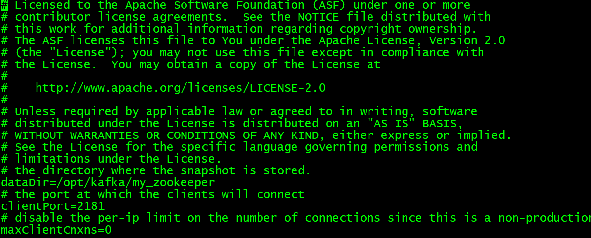

# 第9单元 kafka概述

# 【授课重点】

1. Kafka是什么

2. 消息队列内部的实现原理

3. 为什么需要消息队列

4. Kafka架构

5. 分布式模型

6. Kafka的环境搭建

# 【考核要求】

1. Kafka是什么

2. 消息队列内部的实现原理

3. 为什么需要消息队列

4. Kafka架构

5. 分布式模型

6. Kafka的环境搭建

# 【教学内容】

## 9.1 课程导入

**Kafka是什么?**

 

 Apache Kafka是一个开源**消息**系统，由Scala写成。是由Apache软件基金会开发的一个开源消息系统项目。

 Kafka最初是由LinkedIn开发，并于2011年初开源。2012年10月从Apache Incubator毕业。该项目的目标是为处理实时数据提供一个统一、高通量、低等待的平台。

 **Kafka是一个分布式消息队列：生产者、消费者的功能。**它提供了类似于JMS的特性，但是在设计实现上完全不同，此外它并不是JMS规范的实现。

 Kafka对消息保存时根据Topic进行归类，发送消息者称为Producer,消息接受者称为Consumer,此外kafka集群有多个kafka实例组成，每个实例(server)成为broker。

 无论是kafka集群，还是producer和consumer都依赖于**zookeeper**集群保存一些meta信息，来保证系统可用性


## 9.2为什么需要消息队列

消息系统的核心作用就是三点：解耦，异步和并行

以用户注册的案列来说明消息系统的作用

**用户注册的一般流程**

 

**问题**：随着后端流程越来越多，每步流程都需要额外的耗费很多时间，从而会导致用户更长的等待延迟。

**用户注册的并行执行**

 

**问题**：系统并行的发起了4个请求，4个请求中，如果某一个环节执行1分钟，其他环节再快，用户也需要等待1分钟。如果其中一个环节异常之后，整个服务挂掉了。

 

**用户注册的最终一致**

 


## 9.3 Kafka架构,分布式模型

 Topic ：消息根据Topic进行归类

 Producer：发送消息者,生产者

 Consumer：消息接受者,消费者

 broker：每个kafka实例(server)

 Zookeeper：依赖集群保存meta信息。

 


## 9.4 Kafka的环境搭建

### 9.4.1 **基础环境准备**

安装前的准备工作（zk已经部署完毕）

 关闭防火墙 

```
chkconfig iptables off  && setenforce 0
```


### 9.4.2 kafka单机版安装采用自带的zookeeper处理	

**1.校验一下java是否安装**

​       

```
  java -version
  
​	 java version "1.8.0_171"
​	 Java(TM) SE Runtime Environment (build 1.8.0_171-b11)
​	 Java HotSpot(TM) 64-Bit Server VM (build 25.171-b11, mixed mode)
```

如果没有安装，请先安装java环境 参考JDK安装方法  〜/ .bashrc文件(环境变量配置文件方式二)

**2.上传kafka文件到虚拟机中kafka_2.12-2.2.0**

**课堂案例:**

```
rz 命令调出上传窗口
```

 

**课堂案例:**

```
ll命令查看上传的kafka文件
```

 

**3.解压安装kafka到/usr/local中**

```
tar -zxvf kafka_2.11-1.0.0.tgz -C /opt/

重命名kafka的文件 ：
mv kafka_2.11-1.0.0 /opt/kafka
```

**4.切换到kafka的配置文件目录**

```
pwd

cd /opt/kafka/config
```

**课堂案例:**

 

**5.kafka安装目录下的config文件夹为其配置文件，我们需要修改的有 server.properties和zookeeper.properties。**

```
  mkdir kafka-logs-0

  server.properties：   kafka的配置文件
​  log.dirs=/tmp/kafka-logs
​ 修改为:
​  log.dirs=/opt/kafka1/kafka-logs-0

  zookeeper.properties   kafka自带的zookeeper的配置
​  dataDir=/tmp/zookeeper
​ 修改为:
​  dataDir=/opt/kafka1/my_zookeeper
```

如下图:

 

 

 

 

**6.启动zookeeper**

```
/opt/kafka/bin/zookeeper-server-start.sh  /opt/kafka/config/zookeeper.properties 
```

**7.启动kafka**

```
/opt/kafka/bin/kafka-server-start.sh /opt/kafka/config/server.properties 
```

**8.创建主题 (让我们创建一个名为“test”的主题，它只包含一个分区，只有一个副本)**
        

```
/opt/kafka/bin/kafka-topics.sh --create --zookeeper localhost:2181 --replication-factor 1 --partitions 1 --topic 1704D

​            备注： 或者，您可以将代理配置为在发布不存在的主题时自动创建主题，而不是手动创建主题。
```

**9.查看主题:   如果我们运行list topic命令，我们现在可以看到该主题**

​         

```
/opt/kafka/bin/kafka-topics.sh --list --zookeeper localhost:2181
```

​       

**10.发送一些消息**
          Kafka附带一个命令行客户端，它将从文件或标准输入中获取输入，并将其作为消息发送到Kafka集群。默认情况下，每行将作为单独的消息发送。运行生产者，然后在控制台中键入一些消息以发送到服务器。

​        

```
 /opt/kafka/bin/kafka-console-producer.sh --broker-list localhost:9092 --topic 1704D

​        >等待输入发送的消息
```

**11.启动消费者**

```
/opt/kafka/bin/kafka-console-consumer.sh --bootstrap-server 192.168.25.133:9092 --topic 1704D --from-beginning  从第一条开始接受
/opt/kafka/bin/kafka-console-consumer.sh --bootstrap-server 192.168.25.133:9092 --topic 1704D从现在生产者发送开始接受。
```


```

```

# 课堂练习

**1.完成课堂案例kafka的安装(40分钟)**

